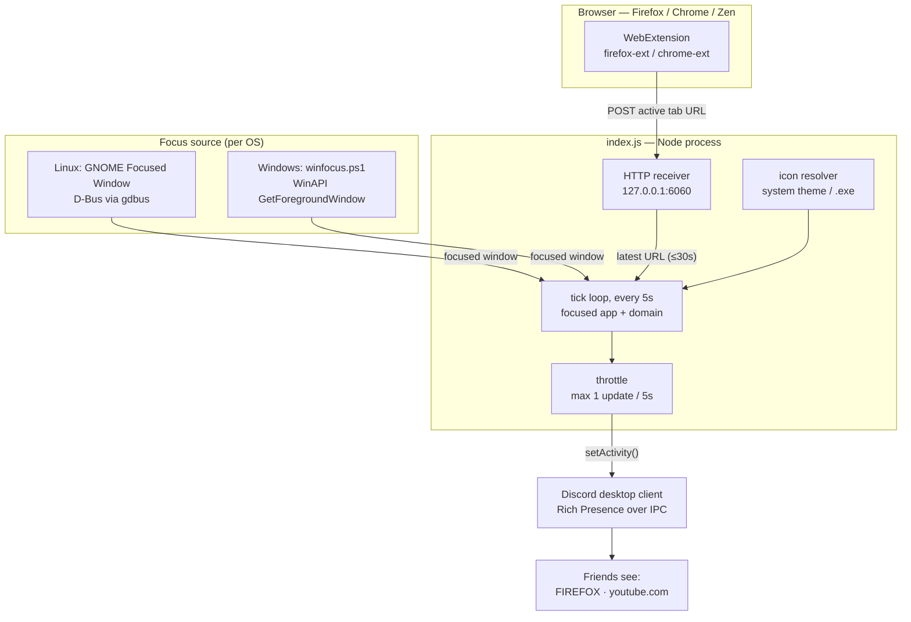

# Discord App Status

Shows the app you're currently focused on as your Discord status — with the app's real icon pulled straight from your system. Works on **Linux (GNOME)** and **Windows**.

Instead of Discord's per-game detection, this reads your focused window and updates your Rich Presence, e.g. `In Firefox`, `In Terminal`, `In Ghidra` — each with its own icon.

## How it works

- **Linux:** a GNOME Shell extension exposes the focused window over D-Bus; icons come from your system icon theme / `.desktop` files.
- **Windows:** the foreground window and its `.exe` are read via PowerShell; the icon is extracted from the executable.
- The icon is uploaded to a public host and passed to Discord as an external image URL. Apps without a local icon fall back to a public icon CDN.

## Architecture



**Flow:** every 5s `index.js` asks the OS which window is focused. If it's a browser, it grabs the latest tab URL that the WebExtension pushed to the local receiver (`127.0.0.1:6060`) and extracts the domain. It resolves the app icon, then sends the whole activity to the Discord desktop client over its local IPC socket — throttled to once per 5s (configurable) to respect Discord's rate limit. Nothing talks to Discord's web API, so no account risk.

## Requirements

- [Node.js](https://nodejs.org) 18+
- Discord running (desktop app)
- **Linux only:** GNOME on Wayland/X11, Python 3 with PyGObject (`python3-gi`), and the [Focused Window D-Bus](https://extensions.gnome.org/extension/5592/focused-window-d-bus/) GNOME extension
- **Windows only:** PowerShell (built in)

## Setup

**Create a Discord application** (both platforms): go to the [Discord Developer Portal](https://discord.com/developers/applications), click **New Application**, and copy the **Application ID** from *General Information*.

Then, in Discord: User Settings → **Activity Privacy** → enable *Share your detected activities with others*, and make sure your status isn't Invisible.

### Linux

1. Install the [Focused Window D-Bus](https://extensions.gnome.org/extension/5592/focused-window-d-bus/) extension and enable it (log out/in if it doesn't activate).
2. Install and run:
   ```bash
   git clone git@github.com:goolyb/Discord-app-status.git
   cd Discord-app-status
   npm install
   ./das setup        # paste your Application ID
   ./das start
   ```

### Windows

```powershell
git clone https://github.com/goolyb/Discord-app-status.git
cd Discord-app-status
npm install
.\das.ps1 setup       # paste your Application ID
.\das.ps1 start
```
> If scripts are blocked, run PowerShell once as: `powershell -ExecutionPolicy Bypass -File .\das.ps1 start`

## Usage

Linux uses `./das <cmd>`, Windows uses `.\das.ps1 <cmd>`. Same commands:

```
setup [ID]          set your Discord Application ID (asks if omitted)
start               start the integration
stop                stop the integration
restart             restart it
status              is it running? + current window
logs                follow the log
enable-autostart    run automatically on login
disable-autostart   don't run on login
block <domain>      hide a site's domain from your status
unblock <domain>    stop hiding a domain
blacklist           list blocked domains
```

## Customizing icons

Names, sizing, and icon overrides live in `config.json`:

- **`iconSize`** — total square canvas resolution for icons (default `256`, e.g. `256`, `512`).
- **`iconContent`** — size of the icon inside the canvas (default `160`; e.g. `192` or `216` for custom padding). Changing `iconSize` or `iconContent` automatically invalidates and re-pads the icon cache.
- **`nameMap`** — map a window class / process name to a nicer display name.
- **`iconOverride`** — pin a specific icon for an app. Matched by substring, so `"ghidra"` catches `ghidraRun-Ghidra` too. Value can be a URL (`"ghidra": "https://.../ghidra.png"`) or a local file (`"discord": "icons/discord.png"`).
- **`yieldToOtherRpc`** — set to `true` (default) to automatically clear status and yield priority when a game (like Dota 2, CS2) or another app uses Discord RPC natively.

On Windows, high-resolution icons (256x256 / 512x512) are extracted directly from `.exe` files via the Win32 `PrivateExtractIcons` API with HighQuality bicubic scaling.

If an app shows the wrong icon or none, add it to `iconOverride`. Cache entries automatically update when size parameters change.

## Showing the current website

Optionally, when a browser is focused the status also shows the active tab's domain (e.g. `FIREFOX` with `youtube.com` underneath). Works the same on **Linux and Windows**.

A tiny bundled WebExtension reports the active tab's URL to a local receiver the script runs on `127.0.0.1:6060` (the receiver starts automatically with `das`/`das.ps1` on both platforms). Only the hostname is used; internal pages (`about:`, `chrome://`, `file:`, …) are ignored, and stale URLs older than 30s are dropped. This works even for sandboxed browsers (e.g. snap Firefox, where remote debugging and the accessibility bus are blocked).

### Hiding sites (blacklist)

Keep certain domains out of your status — friends then see only the browser, no site. Blocked domains **and their subdomains** are hidden (`youtube.com` also hides `m.youtube.com`).

```bash
./das block youtube.com     # hide it (full URLs / www. are cleaned automatically)
./das unblock youtube.com   # show it again
./das blacklist             # list blocked domains
```

Stored in `config.json` under `"blacklist"`; changes apply live within one poll — no restart needed.

Two builds are provided:
- **`firefox-ext/`** — for Firefox and **Zen** (a Firefox fork).
- **`chrome-ext/`** — for Chrome, Chromium, Brave and Edge (Manifest V3).

### Chrome / Chromium / Brave / Edge

1. Open `chrome://extensions` (or `edge://extensions`, `brave://extensions`).
2. Enable **Developer mode** (top-right toggle).
3. Click **Load unpacked** → select the `chrome-ext/` folder.

Persists across restarts, no signing needed.

### Firefox / Zen

Firefox release builds only install signed extensions, so sign it once against your own [addons.mozilla.org API key](https://addons.mozilla.org/developers/addon/api/key/):

```bash
cd firefox-ext
npx web-ext sign --channel=unlisted --api-key=YOUR_KEY --api-secret=YOUR_SECRET
```

This produces a signed `.xpi` in `firefox-ext/web-ext-artifacts/`. Then in Firefox/Zen open `about:addons` → gear ⚙️ → **Install Add-on From File…** → pick the `.xpi`.

For a quick test without signing, load it temporarily via `about:debugging#/runtime/this-firefox` → **Load Temporary Add-on…** → `firefox-ext/manifest.json` (dropped on browser restart).

### Config

- **`iconSize`** — icon canvas dimension in pixels (default `256`).
- **`iconContent`** — icon graphic dimension within canvas (default `160`).
- **`yieldToOtherRpc`** — yield status to native Discord RPC games (default `true`).
- **`urlPort`** — port of the local URL receiver (default `6060`).
- **`urlMaxAgeSeconds`** — ignore reported URLs older than this (default `30`).
- **`pollSeconds`** — how often the focused window is checked (default `5`).
- **`minUpdateSeconds`** — minimum gap between Discord updates (default `5`; don't go below ~4s or Discord rate-limits).
- **`blacklist`** — domains to hide from the status (manage with `./das block`/`unblock`).

## Notes

- Your Application ID is stored in `client-id.txt` (git-ignored), not in `config.json`.
- Windows users can use `.\das.cmd` (e.g. `.\das.cmd start` or double-click `start.cmd`).
- Presence updates are throttled to once per 5s by default (`minUpdateSeconds`), within Discord's Rich Presence rate limit, so rapid window/tab switching won't cause the status to stall.
- Icon URLs are hosted on a free temporary host and auto-refreshed before they expire, so regularly-used apps keep working without intervention.
